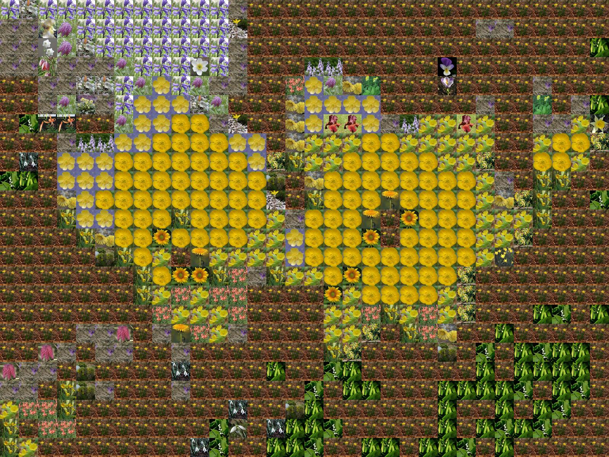

# masaic_task：照片马赛克入门复现

把一张大照片拆成小区域，为每个区域寻找颜色最接近的小照片，再拼成一张新的大图。入口仍然是 `1.py`，使用 Pillow 和 Python 自带的多进程，不需要 GPU 或训练模型。

项目包含 102 张花朵素材和一张目标图，安装依赖后可直接运行。

| 目标图 | 实际生成的照片马赛克 |
| --- | --- |
|  |  |

## 在 VS Code 中运行（Windows）

### 1. 获取并打开项目

如果已经有本地副本，先保存自己的改动，再在项目终端执行 `git pull` 更新。首次获取可执行：

```powershell
git clone https://github.com/1ur-xiaoxiao/masaic_task.git
cd masaic_task
```

也可以在 GitHub 页面点击 **Code → Download ZIP** 并解压。

在 VS Code 选择 **文件 → 打开文件夹**，打开包含 `1.py`、`requirements.txt`、`data` 的 `masaic_task` 文件夹。单独打开 `1.py` 不会加载本项目的调试配置。

### 2. 安装扩展和依赖

安装 Microsoft 发布的 **Python** 和 **Python Debugger** 扩展。电脑需要已安装 Python；本次实测环境为 Python 3.14.4、Pillow 12.2.0。

打开 VS Code 的 **终端 → 新建终端**，确认当前位置是项目目录，然后依次执行：

```powershell
python -m venv .venv
.\.venv\Scripts\python.exe -m pip install -r requirements.txt
```

这里直接使用虚拟环境中的 Python，无需激活虚拟环境。若系统只有 `py` 命令，第一行可以改为 `py -m venv .venv`。

### 3. 生成结果

```powershell
.\.venv\Scripts\python.exe 1.py
```

程序会读取 `data/target.jpg` 和 `data/tiles/`，看到 **Finished, output is in ...** 后，打开 `output/mosaic.jpeg`。

默认结果是 **1600×1200**，共有 **32×24=768** 个小照片块。`Tasks submitted: 100%` 表示任务已经交给工作进程，`Finished` 才表示图片保存完成。每次运行覆盖同一个结果文件。

### 4. 用 F5 调试

1. 按 `Ctrl+Shift+P`，选择 **Python: Select Interpreter / Python: 选择解释器**。
2. 选择本项目的 `.venv\Scripts\python.exe`；列表里没有时，使用“输入解释器路径”。
3. 打开 `1.py`，按 **F5**，选择 **照片马赛克：运行示例**。

已经提供 `.vscode/launch.json`，F5 无需填写参数。可以先在 `TargetImage.get_data()` 中设置断点，观察图片尺寸；再在 `TileFitter.get_best_fit_tile()` 中观察匹配过程。调试配置允许进入子进程，后一个断点可能被多次触发。

## 换成自己的照片

先用小尺寸图片试跑，例如宽 200～400 像素。把照片放进 `data`，例如 `data/my_photo.jpg`：

```powershell
.\.venv\Scripts\python.exe 1.py data/my_photo.jpg data/tiles
```

路径含空格时加双引号。目标照片是“要拼成的大图”；`data/tiles` 中的图片是“用于拼图的小照片”。也可以把自己的 JPG、PNG 等图片放入另一个素材文件夹，将第二个参数换成该文件夹路径。程序递归读取素材，不可读取的文件会显示跳过原因。

## 先理解这三个参数

它们位于 `1.py` 顶部。每次只改一个，运行并比较结果。

| 参数 | 默认值 | 含义 |
| --- | --- | --- |
| `TILE_SIZE` | 50 | 输出图中每张小照片占 50×50 像素；改为 25 后，小块数量增加 |
| `TILE_MATCH_RES` | 5 | 把候选小照片和目标区域都缩成 5×5，用 25 个 RGB 像素比较 |
| `ENLARGEMENT` | 8 | 目标图宽、高都放大 8 倍，随后轻微裁剪以容纳完整的小照片块 |

使用正整数；匹配分辨率建议不超过 `TILE_SIZE`。素材可以重复使用，这也是结果中有些花朵重复出现的原因。默认仅使用最多两个匹配进程，便于初学者在 Windows 上运行和调试。

## 什么算完成这次入门复现

- 能独立安装依赖、生成示例结果，再换自己的目标图。
- 能解释“裁成正方形 → 缩成 5×5 → 比较 RGB 差异平方和 → 粘贴 50×50 图片”的流程。
- 能修改一个参数，并用前后两张结果说明尺寸、细节或速度如何变化。
- 能运行下面的检查，并理解为什么裁剪后需要重新读取图片尺寸。

```powershell
.\.venv\Scripts\python.exe -m unittest discover -s tests -v
```

当前有三个检查：裁剪后块对齐、选择正确颜色、坏素材不影响有效素材。具体改动和实测步骤见 [复现记录](docs/REPRODUCTION.zh-CN.md)。

## 来源

原始照片马赛克代码来自 [codebox/mosaic](https://github.com/codebox/mosaic)，保留其 MIT 许可及 Rob Dawson 的版权声明。这里是在原算法基础上的入门运行与尺寸修正。

示例照片来自 [Oxford 17 Flowers](https://www.robots.ox.ac.uk/~vgg/data/flowers/17/)，采样和预处理方式见 [素材说明](data/README.md)。照片不属于代码的 MIT 许可范围，使用时应遵循原数据提供方的条件。
